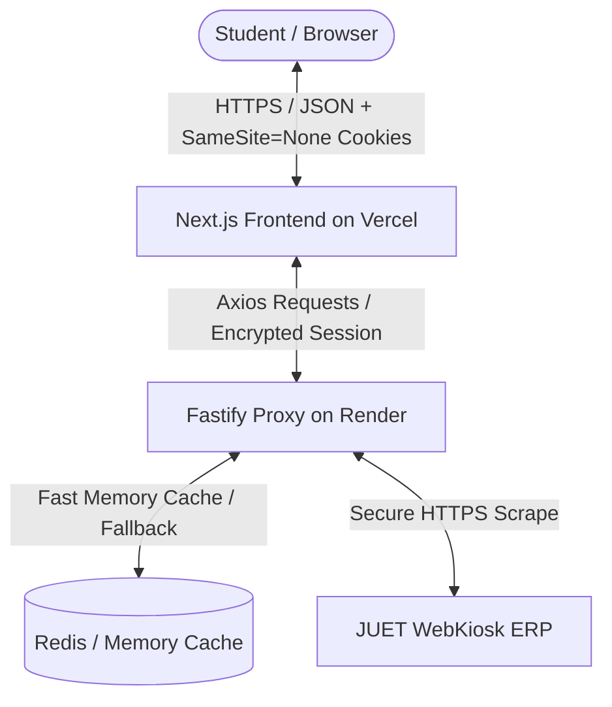
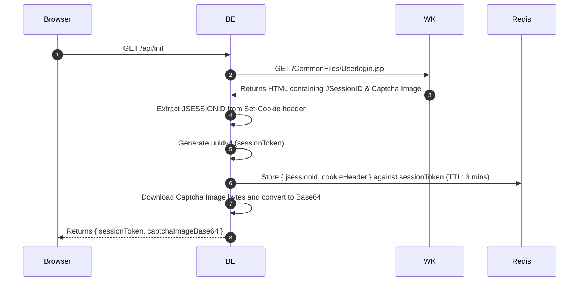
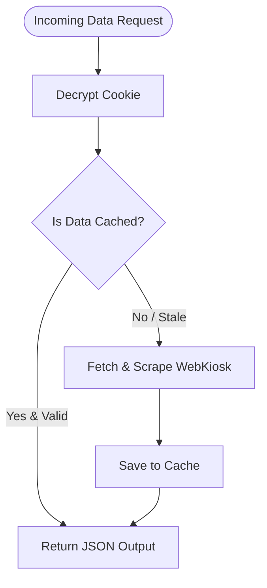

# JUET Nexus: Architecture & Technical Guide

Welcome to the technical architecture guide for **JUET Nexus**. This document provides an exhaustive, low-level explanation of how the system functions, detailing the design patterns, security controls, data flows, and scraping pipelines that power the portal.

---

## 1. System Overview

JUET Nexus acts as a high-performance, secure, and modern middleware layer between the student and the legacy **JUET WebKiosk ERP system** (which is built on older JSP technologies). 

Instead of forcing users to deal with slow load times, non-responsive tables, and manual captcha solving, JUET Nexus scrapes, decrypts, and exposes WebKiosk data via a fast, elegant, and secure dashboard.



---

## 2. Technology Stack

### Frontend (`/frontend`)
*   **Framework:** Next.js 15 (App Router) — handles routing, static optimizations, and component rendering.
*   **Styling:** Tailwind CSS — custom configured with an **Indigo / Violet / Slate** premium color system.
*   **Icons:** Lucide React.
*   **HTTP Client:** Axios — configured with `withCredentials: true` to handle cross-origin cookie state.

### Backend (`/backend`)
*   **Runtime:** Node.js (v18+) with Fastify — Selected for its ultra-low overhead, native schema validations, and high request throughput.
*   **Language:** TypeScript — strict compilation modes (`node16` module resolution) ensuring contract safety.
*   **HTML Parser:** JSDOM — Lightweight DOM simulation used to query legacy HTML pages.
*   **Cache:** Redis (primary) with an in-memory `Map` fallback.
*   **Cryptography:** Node's native `crypto` module (AES-256-GCM).

### Shared Contract (`/shared`)
*   **Types:** Shared TS interfaces defining standard data structures (e.g., Attendance records, User profiles, CGPA statistics, Captcha payloads).

---

## 3. Deep Dive: The Authentication Flow

Connecting a modern stateless frontend to a legacy stateful ERP requires a multi-stage session synchronization process. Below is the detailed authentication lifecycle:

### Stage A: Initialization (`GET /api/init`)
Before the user logs in, the client requests a fresh login page from WebKiosk.



1. **ERP Ping:** The backend makes a GET request to the WebKiosk login page.
2. **Session Capture:** WebKiosk initializes a session and responds with a `Set-Cookie` header containing a `JSESSIONID`.
3. **Session Token Generation:** The backend generates a random `sessionToken` (UUIDv4) and stores the WebKiosk `JSESSIONID` inside its Redis/in-memory cache mapped to this token.
4. **Captcha Scrape:** The backend grabs the captcha image bytes from the WebKiosk response, converts them to a Base64 string, and sends this to the frontend along with the `sessionToken`.

---

### Stage B: Logging In (`POST /api/auth`)
Once the user types their details (Enrollment, Password, Captcha, DOB) and submits:

```mermaid
sequenceDiagram
    autonumber
    Browser->>BE: POST /api/auth { enrollment, password, captcha, sessionToken, ... }
    BE->>Redis: Retrieve { cookieHeader } using sessionToken
    BE->>WK: POST /CommonFiles/UserLoginAction.jsp (with Form Data & JSESSIONID Cookie)
    WK-->>BE: 200 OK + HTML redirection response
    BE->>WK: GET /StudentFiles/FrameLeftStudent.jsp (Verification check)
    alt Session is Valid
        WK-->>BE: Returns profile page containing student details
        BE->>BE: Encrypt JSESSIONID with AES-256-GCM
        BE-->>Browser: Set-Cookie: auth=<encrypted_jsessionid> (SameSite=None; Secure)
    else Session is Invalid
        WK-->>BE: Returns "Session Timeout!" or "Password Incorrect"
        BE-->>Browser: 401 Unauthorized (Error Message)
    end
```

1. **Payload Extraction:** The frontend sends the credentials, the solved captcha, and the matching `sessionToken`.
2. **Session Association:** The backend retrieves the raw `JSESSIONID` associated with the `sessionToken` from the cache.
3. **ERP Authentication:** The backend sends a POST request to WebKiosk's login handler containing the student credentials and captcha, passing the raw `JSESSIONID` in the `Cookie` header.
4. **Authentication Check:** WebKiosk always responds with HTTP 200, redirecting the user via JavaScript. To check if login actually succeeded, the backend immediately queries a protected student page (e.g., `FrameLeftStudent.jsp`) using that `JSESSIONID`.
    *   If WebKiosk responds with `"Session timeout!"` or `"Please Login"`, the login failed, and the backend returns `401 Unauthorized`.
    *   If the page loads student information, authentication is successful.
5. **Secure Cookie Issuance:** The backend encrypts the validated `JSESSIONID` using **AES-256-GCM** (authenticated symmetric encryption) with the server's private `ENCRYPTION_KEY`. It sends this encrypted string back to the user's browser in a cookie named `auth`.

---

## 4. Cryptography & Session Security

To protect credentials, the proxy never exposes raw WebKiosk sessions or cleartext passwords.

### AES-256-GCM Cookie Encryption
When setting the `auth` cookie, the backend uses a secure initialization vector (IV) and creates an authentication tag to prevent tampering:
*   **Cipher:** `aes-256-gcm`
*   **Encryption Key:** A secure 256-bit key configured via environment variables (`ENCRYPTION_KEY`).
*   **Initialization Vector (IV):** A unique 12-byte random buffer generated per encryption request.
*   **Auth Tag:** Used to verify data integrity (prevents bit-flipping attacks).
*   **Structure:** The cookie string is formatted as `hex(iv):hex(authTag):hex(encryptedData)`.
*   **Decryption:** On incoming requests, the backend splits the cookie by `:`, extracts the components, validates the authentication tag, and decrypts the session back to the raw `JSESSIONID`.

### Cookie Constraints (Cross-Origin Setup)
To allow the Next.js frontend (on Vercel) to query the Fastify backend (on Render), the cookie is set with strict security attributes:
```typescript
reply.setCookie("auth", encryptedSession, {
  httpOnly: true,                  // Blocks client-side scripts from reading the cookie
  secure: true,                    // Enforces transmission ONLY over HTTPS connections
  sameSite: "none",                // Mandatory for cross-origin AJAX requests
  maxAge: 15 * 60,                 // Expires in 15 minutes
  path: "/",
});
```

---

## 5. Web Scraper & Parser Mechanics

Because WebKiosk returns raw HTML instead of JSON APIs, the backend acts as a parser. Instead of running a heavy headless browser like Puppeteer (which consumes ~150MB of RAM per instance), JUET Nexus uses **JSDOM** + **Axios** (which consumes <5MB of RAM per request).

### Scraping Pipeline
1. **Fetch Page:** The backend calls the target WebKiosk sub-page (e.g., Exam Marks, Attendance tables) passing the decrypted `JSESSIONID` in the `Cookie` header.
2. **HTML Parse:** The raw HTML response string is fed into JSDOM to build a virtual DOM tree.
3. **DOM Querying:** Standard CSS selectors (`querySelector`, `querySelectorAll`) are used to select table rows (`tr`) and columns (`td`).
4. **Data Sanitization:**
    *   Cleans trailing whitespaces, non-breaking space characters (`&nbsp;`), and raw HTML tags.
    *   Parses numeric values (e.g. converting string percentages like `"75.50%"` to float numbers `75.5`).
5. **Object Structuring:** The parsed rows are structured into TypeScript array contracts and sent to the frontend.

---

## 6. Caching System

WebKiosk is notoriously slow and unstable. To prevent heavy concurrent scrapers from crashing the ERP or causing request timeouts, JUET Nexus implements a dual-tier caching layer.



### Cache Keys & Storage
*   **Key Format:** `prefix:enrollment` (e.g., `attendance:211B001`).
*   **Redis Tier:** Mapped using `ioredis`. If a Redis URL is provided, all cache values are stored in Redis with standard Time-To-Live (TTL) values.
*   **Fallback Memory Tier:** If Redis is down or unconfigured, the app dynamically falls back to an in-memory `Map` caching implementation without breaking the server.
*   **Caching Windows:**
    *   **Student Profile:** Cached for 60 minutes (rarely changes).
    *   **Performance / CGPA:** Cached for 30 minutes.
    *   **Attendance Data:** Cached for 15 minutes.

---

## 7. Frontend Layout & Interactivity

The frontend handles complex client-side calculations and premium transitions:

### Click-Outside Collapsible Sidebar
To create a clean sidebar workflow:
1. When mounted, the layout sets up a global document mouse listener.
2. If the user clicks outside the sidebar element, it collapses into a slim 20-pixel toolbar (`lg:w-20`).
3. If the user clicks inside, it expands back to the full list (`lg:w-64`).
4. **Safety Check:** Evaluates `typeof target.closest === "function"` before invoking DOM element operations to prevent errors when clicking raw text nodes or document frame wrappers.

### Bunk Meter Simulators
The Bunk Meter does not fetch simulations from the backend; it computes them instantly client-side using algebraic formulas:
*   **Classes to Attend to Reach Target ($T$):**
    Given current classes attended ($A$) and total classes conducted ($C$):
    $$\text{Classes to Attend } (X) = \left\lceil \frac{T \cdot C - 100 \cdot A}{100 - T} \right\rceil$$
*   **Safe Classes to Bunk to Maintain Target ($T$):**
    $$\text{Safe Bunks } (Y) = \left\lfloor \frac{100 \cdot A - T \cdot C}{T} \right\rfloor$$

---

## 8. Deployment Settings Checklist

For successful cloud hosting, configure your settings as follows:

| Environment Variable | Service | Purpose | Value (Example) |
| :--- | :--- | :--- | :--- |
| `NODE_ENV` | Backend | Disables verbose logging & secures cookies | `production` |
| `ENCRYPTION_KEY` | Backend | Key used to encrypt `JSESSIONID` | Hexadecimal string (64 characters) |
| `CORS_ORIGIN` | Backend | Configures CORS headers on Fastify | `https://juet-nexus.vercel.app` |
| `FRONTEND_URL` | Backend | Maps cookie origins | `https://juet-nexus.vercel.app` |
| `WEBKIOSK_BASE_URL` | Backend | Legacy WebKiosk endpoint | `https://webkiosk.juet.ac.in` |
| `NEXT_PUBLIC_API_URL` | Frontend | Maps AJAX requests to API | `https://juet-nexus-api.onrender.com` |
