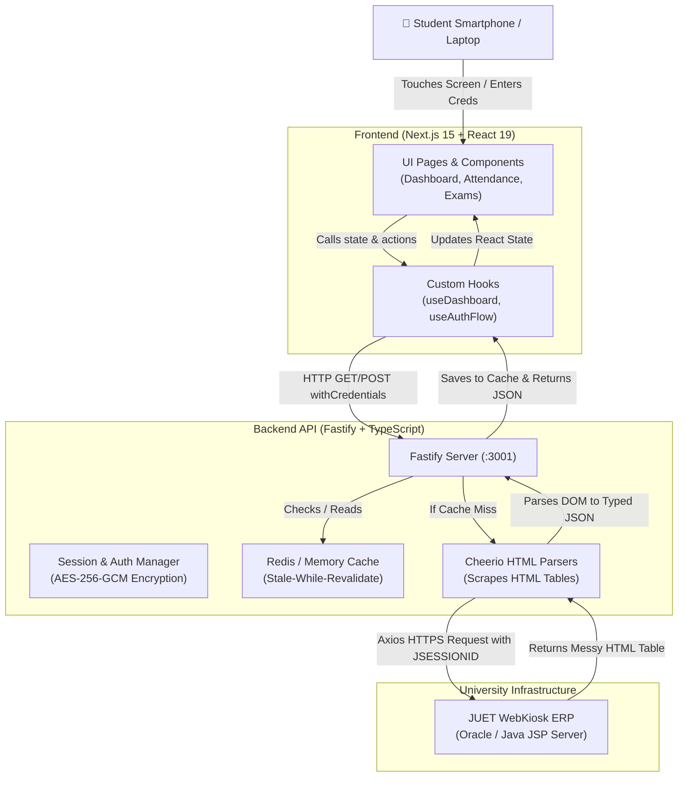

# JUET Nexus — End-to-End Project Architecture & Beginner's Guide

> **What is JUET Nexus?**  
> JUET Nexus is a modern, high-speed, mobile-first web dashboard that solves a universal problem for university students: their official ERP portal (WebKiosk / CampusLynx) has a clunky 1990s interface, requires solving captchas on every visit, logs out automatically after 5 minutes of inactivity, and is painful to use on smartphones.
> 
> Because the university does **not** provide a database or a public REST API, JUET Nexus acts as an intelligent **reverse proxy and scraper**. It logs into the portal on the student's behalf, extracts attendance, marks, and timetables from raw HTML, caches the data in Redis, and renders a dashboard with attendance calculators, GPA predictors, and dark mode.

---

## 1. High-Level Architecture & End-to-End Data Flow



---

## 2. Step-by-Step Example: How Data Flows Through the App

Let's trace what happens when a student signs in and views their attendance:

### Step 1: The Student Submits Login Form (Frontend)
- The user enters their enrollment number (`24BCS100`), password, and the captcha letters shown on screen into [`CampusLynxLoginForm.tsx`](file:///d:/Projects/JUET/frontend/components/CampusLynxLoginForm.tsx).
- When they tap **"Sign In"**, the React hook [`useAuthFlow.ts`](file:///d:/Projects/JUET/frontend/hooks/useAuthFlow.ts) sends an HTTP POST request:
  ```http
  POST http://localhost:3001/api/auth/login
  Content-Type: application/json
  {
    "enrollment": "24BCS100",
    "password": "mypassword123",
    "captchaInput": "K9XP"
  }
  ```

### Step 2: The Fastify Backend Intercepts the Login (Backend)
- In [`backend/src/routes/auth.ts`](file:///d:/Projects/JUET/backend/src/routes/auth.ts), Fastify receives the credentials.
- The backend makes an HTTP POST request to the university WebKiosk server using [`axios`](file:///d:/Projects/JUET/backend/src/utils/axios.ts) equipped with a cookie jar (`JSESSIONID`).

### Step 3: Handling the University Portal Quirks
- **Gotcha**: WebKiosk *always* returns HTTP status `200 OK`, even if the password was wrong!
- The backend parser checks the HTML body for text like `"Invalid Password"`, `"Session Timeout"`, or whether the page returned is fewer than 200 bytes.
- If invalid, the backend sends an error back to the frontend (`"Invalid credentials or captcha"`).
- If successful, login succeeds!

### Step 4: The Silent Re-Login Secret (`auth` cookie)
- WebKiosk sessions expire in 5 minutes. Normally, the student would have to solve a captcha again.
- To prevent this, JUET Nexus encrypts the student's credentials along with the `JSESSIONID` using military-grade **AES-256-GCM** encryption (via [`backend/src/utils/encryption.ts`](file:///d:/Projects/JUET/backend/src/utils/encryption.ts)).
- The backend sets an `httpOnly`, secure cookie named `auth` in the student's browser:
  ```http
  Set-Cookie: auth=a1b2c3...[encrypted hex]...; HttpOnly; SameSite=Lax; Max-Age=2592000
  ```
  *(The browser stores this safely. JavaScript cannot read it, preventing XSS attacks).*

### Step 5: Loading the Attendance Dashboard
- The frontend redirects to `/dashboard`.
- The hook [`useDashboard.ts`](file:///d:/Projects/JUET/frontend/hooks/useDashboard.ts) makes a request:
  ```http
  GET http://localhost:3001/api/dashboard
  Cookie: auth=...
  ```
- Fastify passes this to [`backend/src/routes/dashboard.ts`](file:///d:/Projects/JUET/backend/src/routes/dashboard.ts).

### Step 6: Cache Check (Fast-path)
- The backend checks [`CacheService`](file:///d:/Projects/JUET/backend/src/utils/cache.ts) for `dashboard:24BCS100`.
- **If Cached (Cache Hit)**: The backend returns the cached attendance JSON in **~5 milliseconds** without touching the slow college server at all!
- **If Not Cached (Cache Miss)**:
  1. The backend uses the active session to fetch WebKiosk's raw attendance HTML page (`StudentAttendance.jsp`).
  2. If the session expired, the backend automatically uses the decrypted credentials from the cookie to silently re-login in the background without disturbing the student!

### Step 7: Web Scraping with Cheerio (Turning HTML into JSON)
- WebKiosk returns thousands of lines of messy HTML tables:
  ```html
  <table border="1">
    <tr><td>Data Structures</td><td>30</td><td>26</td><td>86.67%</td></tr>
  </table>
  ```
- The scraper in [`backend/src/parsers/dashboard.ts`](file:///d:/Projects/JUET/backend/src/parsers/dashboard.ts) uses **Cheerio** (which works like jQuery inside Node.js) to query `table tr`:
  ```ts
  const subject = $(row).find("td").eq(0).text().trim();
  const attended = parseInt($(row).find("td").eq(1).text());
  const total = parseInt($(row).find("td").eq(2).text());
  ```
- It computes bunk metrics with [`calculateBunkStatus`](file:///d:/Projects/JUET/backend/src/utils/bunkPlanner.ts) (`"Safe to miss 2 classes"`).
- It saves the result in Redis for future requests.

### Step 8: Rendering the UI (Frontend)
- Fastify sends the clean JSON response to Next.js.
- [`AttendanceTracker.tsx`](file:///d:/Projects/JUET/frontend/components/AttendanceTracker.tsx) receives the array of courses.
- React renders animated SVG circular progress gauges, attendance status tags ("SAFE", "CAUTION", "CRITICAL"), and interactive simulator buttons.

---

## 3. Where is Data Stored? (Database & Storage Architecture)

| Layer | Storage Medium | What is Stored | Why? |
| :--- | :--- | :--- | :--- |
| **Source of Truth** | University Oracle/SQL Database | Student records, official marks, official attendance logs | We do not have direct SQL access; all data originates here. |
| **Backend Cache** | **Redis** (or fallback In-Memory Map) | Parsed JSON for Dashboard, Courses, Grades, Exams | WebKiosk is notoriously slow and crashes under load. Caching gives 10ms responses and protects the portal from being spammed. |
| **Session Vault** | **AES-256-GCM Encrypted Cookie** | Credentials + current `JSESSIONID` | Allows the backend to silently re-login when the college portal expires the session, providing an uninterrupted user experience. |
| **Frontend Browser** | **Browser LocalStorage** | Display Name, Enrollment No., Branch, Theme (Dark/Light) | Used only for instant client-side UI hydration so the layout doesn't flash empty content while fetching. |

---

## 4. Key Folders & Files Breakdown

### The Monorepo Structure
The repository uses **npm workspaces**, meaning the frontend and backend share one repository and depend on a shared type contract:

```
JUET/
├── shared/
│   └── types/
│       └── index.ts         <-- Shared TypeScript interfaces (Contract)
├── backend/                 <-- Fastify Server (Scraper + Proxy API)
│   ├── src/
│   │   ├── index.ts         <-- Backend entrypoint
│   │   ├── routes/          <-- API Endpoints (/api/auth, /api/dashboard, etc.)
│   │   ├── parsers/         <-- Cheerio HTML scrapers
│   │   └── utils/           <-- Cache, AES encryption, Axios instance, GPA math
│   └── tests/               <-- Hermetic Jest unit tests (mocked WebKiosk)
└── frontend/                <-- Next.js 15 App Router (Interactive UI)
    ├── app/                 <-- Next.js pages & routes
    ├── components/          <-- React UI widgets (AttendanceTracker, Modals)
    ├── hooks/               <-- React data-fetching hooks (useDashboard, useAuthFlow)
    └── context/             <-- Global React state (ThemeContext)
```

### Essential Files to Understand

1. [`shared/types/index.ts`](file:///d:/Projects/JUET/shared/types/index.ts)
   - **Purpose**: Defines what data looks like everywhere (e.g. `AttendanceRecord`, `StudentProfile`, `ExamScheduleItem`).
   - **Why it matters**: If backend changes a field name, TypeScript immediately flags errors across the frontend at compile time.

2. [`backend/src/index.ts`](file:///d:/Projects/JUET/backend/src/index.ts)
   - **Purpose**: Bootstraps the Fastify server, registers CORS, cookies, routes, and validates the 64-character encryption key from `.env`.

3. [`backend/src/parsers/dashboard.ts`](file:///d:/Projects/JUET/backend/src/parsers/dashboard.ts)
   - **Purpose**: The "heart" of the scraper. Extracts student name, semester, courses, attendance percentages, and bunk limits from HTML.

4. [`backend/src/utils/encryption.ts`](file:///d:/Projects/JUET/backend/src/utils/encryption.ts)
   - **Purpose**: Encrypts and decrypts cookies with 256-bit AES-GCM and a cryptographically random initialization vector (IV).

5. [`backend/src/utils/cache.ts`](file:///d:/Projects/JUET/backend/src/utils/cache.ts)
   - **Purpose**: Provides a unified caching layer. If Redis is running, it uses Redis; otherwise, it falls back to a Node.js `Map` in memory.

6. [`frontend/components/DashboardLayout.tsx`](file:///d:/Projects/JUET/frontend/components/DashboardLayout.tsx) & [`MobileBottomNav.tsx`](file:///d:/Projects/JUET/frontend/components/MobileBottomNav.tsx)
   - **Purpose**: Shell for the dashboard. Handles responsive desktop sidebars, bottom navigation on mobile, and safe-area padding for mobile notches.

7. [`frontend/components/AttendanceTracker.tsx`](file:///d:/Projects/JUET/frontend/components/AttendanceTracker.tsx)
   - **Purpose**: Displays courses with SVG progress rings and tells students how many lectures they can safely miss before dropping below the 75% attendance cutoff.

---

## 5. Technologies & Libraries Explained Simply

| Technology / Tool | What is it? | Why did we use it here? |
| :--- | :--- | :--- |
| **Next.js 15 (App Router)** | React Framework | Gives fast page loading, server components, and folder-based routing (`app/dashboard/page.tsx`). |
| **Fastify** | Node.js Backend Framework | Express is old and slower. Fastify is built for high speed, low overhead, and excellent schema validation. |
| **TypeScript** | Typed JavaScript | Prevents runtime bugs (`cannot read property of undefined`) and guarantees frontend and backend agree on data shapes. |
| **Cheerio** | Fast HTML parser | Runs inside Node.js. It lets us write `$("table.attendance tr").each(...)` to parse HTML in milliseconds without loading a slow browser like Puppeteer. |
| **Tailwind CSS** | Styling engine | Utility classes (`p-4 bg-white rounded-2xl md:flex`) allow quick, maintainable, responsive mobile design and dark mode. |
| **Redis** | In-Memory Database | Key-value store that keeps parsed attendance cached in RAM so subsequent student page loads take under 10ms. |
| **AES-256-GCM** | Symmetric Encryption | Authenticated encryption standard. Guarantees that session cookies cannot be read or forged by third parties. |
| **Lucide React** | Icon library | Clean, lightweight SVG icons (`CheckCircle`, `Calendar`, `TrendingUp`) that render quickly. |

---

## 6. Beginner's Learning Roadmap: How to Build This From Scratch

If you want to build a similar scraper/dashboard project from scratch, follow this step-by-step roadmap:

```
[Phase 1: Basics] ──> [Phase 2: Scraper API] ──> [Phase 3: Frontend UI] ──> [Phase 4: Advanced]
JavaScript & HTML     Node.js + Cheerio          React & Tailwind           Redis & AES Cookies
```

### Phase 1: Core Fundamentals (Week 1–2)
- **HTML & DOM Structure**: Inspect web pages using browser DevTools. Learn how `<table>`, `<tr>`, `<td>`, `<form>`, and `<input>` are structured.
- **JavaScript Fundamentals**: Arrays, Objects, Array methods (`.map()`, `.filter()`, `.reduce()`), Promises, and `async`/`await`.
- **TypeScript Basics**: Types, Interfaces, and generic parameters.

### Phase 2: Building the Scraper & Backend (Week 3–4)
- **Node.js & HTTP**: Learn how client-server communication works (Headers, Status Codes, Cookies).
- **Axios**: How to send a GET and POST request and store response cookies.
- **Cheerio**: Load a downloaded `.html` file and extract table data using CSS selectors.
- **Fastify (or Express)**: Build your first API routes (`GET /api/attendance`) returning the scraped JSON.

### Phase 3: Building the UI (Week 5–6)
- **React Basics**: Components, JSX, props, and hooks (`useState`, `useEffect`).
- **Tailwind CSS**: Flexbox, CSS Grid, responsive prefixes (`sm:`, `md:`, `lg:`), and dark mode.
- **Next.js App Router**: Page routing (`/`, `/login`, `/dashboard`).
- **Connecting Frontend to Backend**: Use `fetch()` or `axios` with `credentials: "include"` to fetch data from your API.

### Phase 4: Polish & Production Features (Week 7+)
- **Session Management**: Encrypting sensitive session cookies.
- **Caching**: Implementing Redis or simple in-memory caching to prevent duplicate scraper calls.
- **Mobile Friendliness**: Safe area insets, touch-target optimization, and responsive layouts.

### 💡 What Can You Skip Initially as a Beginner?
- **Skip VAPID Web Push Notifications**: Advanced feature; can easily be added later.
- **Skip Redis setup initially**: A basic JavaScript `Map()` or plain memory cache works great while learning locally.
- **Skip Complex Dockerization / CI pipelines**: Run `npm run dev` directly on your laptop until your application works end-to-end.

---

## 7. The Most Important Code Snippet to Study

If you only read one part of the backend code to understand how scraping works, look at this simplified concept from [`backend/src/parsers/dashboard.ts`](file:///d:/Projects/JUET/backend/src/parsers/dashboard.ts):

```typescript
import * as cheerio from "cheerio";

export function parseAttendanceHtml(html: string) {
  // 1. Load the raw HTML string into Cheerio (works like jQuery)
  const $ = cheerio.load(html);
  const records = [];

  // 2. Loop over every row of the attendance table
  $("table#attendanceTable tr").each((index, row) => {
    // Skip table header
    if (index === 0) return;

    const cells = $(row).find("td");
    const subject = $(cells[0]).text().trim();
    const attended = parseInt($(cells[1]).text().trim(), 10);
    const held = parseInt($(cells[2]).text().trim(), 10);
    const percentage = held > 0 ? (attended / held) * 100 : 0;

    // 3. Push formatted, typed data
    records.push({
      subject,
      classesAttended: attended,
      classesHeld: held,
      percentage: Math.round(percentage * 10) / 10,
    });
  });

  return records;
}
```

And on the frontend, in [`frontend/hooks/useDashboard.ts`](file:///d:/Projects/JUET/frontend/hooks/useDashboard.ts):

```typescript
// React hook fetches the data and puts it in component state
const [data, setData] = useState(null);

useEffect(() => {
  fetch("http://localhost:3001/api/dashboard", { credentials: "include" })
    .then((res) => res.json())
    .then((jsonData) => setData(jsonData));
}, []);
```

---

## Summary
JUET Nexus turns a legacy, slow portal into a modern dashboard:
1. **Frontend**: Next.js 15 UI with mobile-first components and dark mode.
2. **Backend**: Fastify proxy that scrapes HTML via Cheerio and handles silent authentication via AES-256-GCM.
3. **Cache**: Redis / memory cache ensuring instant sub-20ms page loads.
4. **Data Source**: Official university ERP, accessed securely on behalf of the student.
