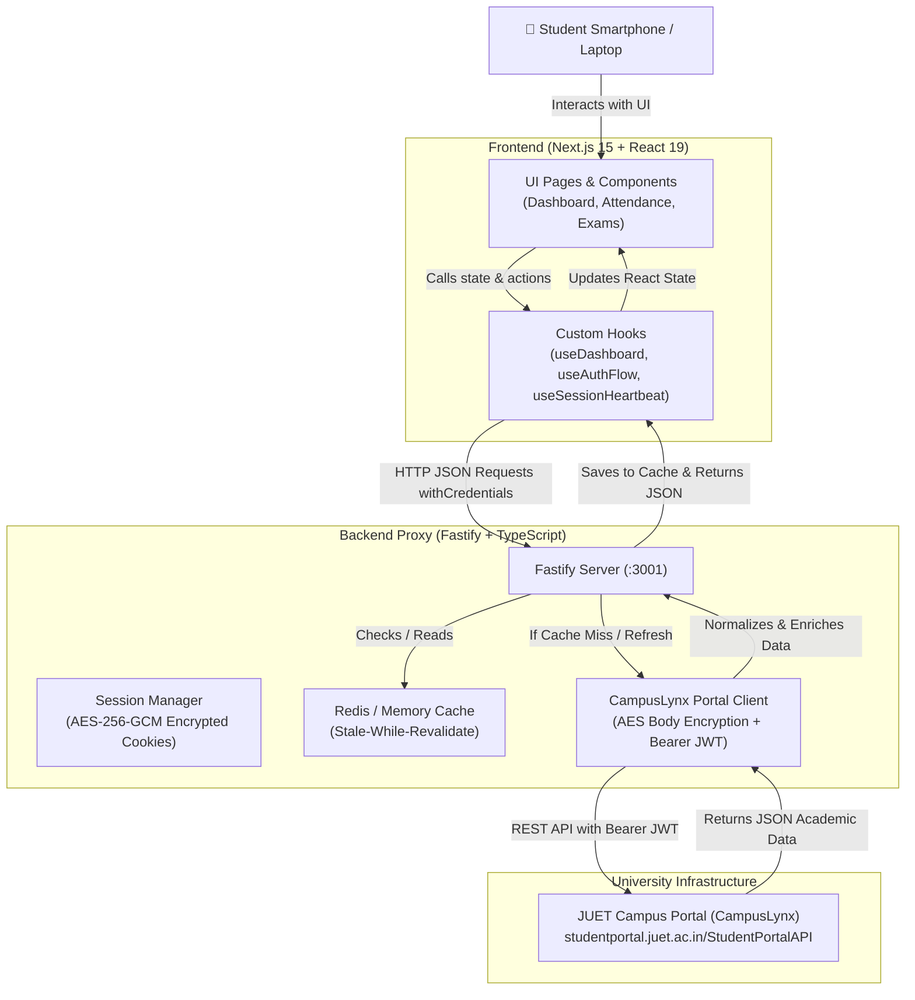

# JUET Nexus — End-to-End Project Architecture & Guide (Campus Portal / CampusLynx)

> **What is JUET Nexus?**  
> JUET Nexus is a modern, high-speed, mobile-first academic portal client and proxy for Jaypee University of Engineering and Technology (JUET). Built on Next.js 15 App Router and Fastify, it connects directly to the official **JUET Campus Portal (CampusLynx)** at `studentportal.juet.ac.in`.
> 
> While the university's official Campus Portal offers core student services, it suffers from short session timeouts, a multi-screen login sequence, no interactive attendance planning, and poor offline resilience. JUET Nexus wraps the Campus Portal REST API with **permanent sliding session persistence**, **interactive attendance simulation ("Safe to skip / Must attend" calculators)**, **SGPA/CGPA analytics**, and a **mobile-first interface**.

---

## 1. High-Level Architecture & End-to-End Data Flow



---

## 2. Step-by-Step Example: How Data Flows Through the App

Here is the exact lifecycle of how a student signs in and accesses their academic data:

### Step 1: Captcha Generation (Portal -> Backend -> Frontend)
- When the student visits `/login`, the frontend hook [`useAuthFlow.ts`](file:///d:/Projects/JUET/frontend/hooks/useAuthFlow.ts) requests a captcha:
  ```http
  GET http://localhost:3001/api/auth/captcha
  ```
- The backend [`client.ts`](file:///d:/Projects/JUET/backend/src/portal/client.ts) calls the Campus Portal's `/token/getcaptcha` endpoint.
- Campus Portal returns a Base64-encoded captcha image and captcha identifier, which [`CampusLynxLoginForm.tsx`](file:///d:/Projects/JUET/frontend/components/CampusLynxLoginForm.tsx) displays to the student.

### Step 2: The Student Submits Login Form (Frontend)
- The student enters their Enrollment Number (`24BCS100`), Password, and Captcha code on a single unified card.
- Tapping **"Sign In"** sends a single request:
  ```http
  POST http://localhost:3001/api/auth/login
  Content-Type: application/json
  {
    "enrollment": "24BCS100",
    "password": "mypassword123",
    "captchaInput": "K9XP"
  }
  ```

### Step 3: Two-Stage Campus Portal Authentication Pipeline (Backend)
The official Campus Portal requires a strict two-stage authentication handshake:
1. **Stage 1 (Pre-Token Check)**:
   - The backend calls `/token/pretoken-check` with the enrollment number, user type (`"S"` for Student), and captcha code.
   - Campus Portal verifies the captcha and returns a cryptographic nonce (`random`) and login mode (`"PWD"`).
2. **Stage 2 (Web Token Generation)**:
   - The backend calls `/token/generatewebtoken` with the user's password, the `random` nonce, and module name (`"Student"`).
   - Campus Portal verifies the password and issues a **Bearer JWT token** along with student identity information (name, branch, semester).

*(JUET Nexus automates both stages sequentially on the backend so the student only clicks "Sign In" once).*

### Step 4: Permanent Sliding Session (`auth` cookie)
- Rather than expiring after 5 minutes of inactivity, JUET Nexus encrypts the student's Campus Portal identity and JWT token using **AES-256-GCM** via [`encryption.ts`](file:///d:/Projects/JUET/backend/src/utils/encryption.ts).
- The backend sets a secure `httpOnly` cookie named `auth` in the student's browser:
  ```http
  Set-Cookie: auth=a1b2c3...[encrypted hex]...; HttpOnly; SameSite=Lax; Max-Age=2592000
  ```
- **Sliding Persistence**: Every authenticated API request automatically extends the session cookie.
- **Heartbeat Ping**: A background client hook ([`useSessionHeartbeat.ts`](file:///d:/Projects/JUET/frontend/hooks/useSessionHeartbeat.ts)) pings the server periodically, keeping the student permanently logged in until they explicitly tap "Logout".

### Step 5: Loading the Attendance Dashboard
- The frontend redirects to `/dashboard`.
- The hook [`useDashboard.ts`](file:///d:/Projects/JUET/frontend/hooks/useDashboard.ts) makes an authenticated request:
  ```http
  GET http://localhost:3001/api/dashboard
  Cookie: auth=...
  ```
- Fastify passes this to [`backend/src/routes/dashboard.ts`](file:///d:/Projects/JUET/backend/src/routes/dashboard.ts).

### Step 6: Stale-While-Revalidate Caching Layer
- The backend checks [`CacheService`](file:///d:/Projects/JUET/backend/src/utils/cache.ts) for `dashboard:24BCS100`.
- **Cache Hit (Fresh)**: If data was retrieved within 5 minutes, it returns immediately in **~5ms**!
- **Cache Miss or Stale**: The backend uses the decrypted JWT token to query the Campus Portal API:
  ```http
  POST https://studentportal.juet.ac.in/StudentPortalAPI/StudentAttendance
  Authorization: Bearer <JWT_TOKEN>
  ```
- The backend normalizes the response, calculates bunk allowances ("Safe to miss 2 classes" or "Must attend 3"), saves it in the cache, and sends clean JSON to the frontend.

### Step 7: Rendering the UI (Frontend)
- [`AttendanceTracker.tsx`](file:///d:/Projects/JUET/frontend/components/AttendanceTracker.tsx) receives the course array.
- React renders interactive course cards with animated SVG progress rings, SAFE/CAUTION/CRITICAL status badges, and bunk planner metrics.

---

## 3. Where is Data Stored? (Database & Storage Architecture)

| Layer | Storage Medium | What is Stored | Purpose |
| :--- | :--- | :--- | :--- |
| **Upstream Source of Truth** | **Campus Portal Database** | Official student academic records, marks, attendance, exam schedules | The university database. JUET Nexus communicates via CampusLynx REST APIs. |
| **Backend Cache** | **Redis** (or In-Memory Map fallback) | Parsed, normalized JSON for Dashboard, Courses, Grades, Exams | Provides instant 10ms responses and protects the university server from traffic spikes during exams and result announcements. |
| **Session Vault** | **AES-256-GCM Encrypted Cookie** | Campus Portal JWT + student identity | Stores authenticated session state safely on the client without exposing plain tokens to client JavaScript (XSS-safe). |
| **Frontend Browser** | **Browser LocalStorage** | Display Name, Enrollment No., Branch, Theme Preference | Used for instant client-side UI hydration so the layout doesn't flash empty content while loading. |

---

## 4. Key Folders & Files Breakdown

### The Monorepo Structure
The repository uses **npm workspaces** linking frontend, backend, and shared type definitions:

```
JUET/
├── shared/
│   └── types/
│       └── index.ts              <-- Single source of truth TypeScript contract
├── backend/                      <-- Fastify Server (Campus Portal Proxy & Cache)
│   ├── src/
│   │   ├── index.ts              <-- Server bootstrap & route registration
│   │   ├── portal/               <-- Official Campus Portal (CampusLynx) API client
│   │   │   ├── client.ts         <-- HTTP transport with AES body encryption
│   │   │   ├── auth.ts           <-- Two-stage login orchestration
│   │   │   ├── attendance.ts     <-- Attendance data fetching & normalization
│   │   │   ├── grades.ts         <-- SGPA, CGPA, semester transcripts
│   │   │   ├── exam.ts           <-- Exam schedules, paper dates, rooms, seats
│   │   │   ├── crypto.ts         <-- Portal payload AES cipher & nonces
│   │   │   └── types.ts          <-- Campus Portal payload & response interfaces
│   │   ├── routes/               <-- REST endpoints (/api/auth, /api/dashboard, etc.)
│   │   └── utils/                <-- Cache, AES-256 session encryption, bunk calculations
│   └── tests/                    <-- Hermetic Jest unit tests (mocked portal transport)
└── frontend/                     <-- Next.js 15 App Router (Interactive UI)
    ├── app/                      <-- Next.js pages (/login, /dashboard, /courses, /exam)
    ├── components/               <-- Reusable UI widgets (AttendanceTracker, Modals)
    ├── hooks/                    <-- React state & API hooks (useDashboard, useAuthFlow)
    └── context/                  <-- ThemeContext (Dark/Light mode & custom accents)
```

### Essential Files to Understand

1. [`shared/types/index.ts`](file:///d:/Projects/JUET/shared/types/index.ts)
   - **Purpose**: Defines shared TypeScript interfaces (e.g. `AttendanceRecord`, `SemesterRecord`, `ExamScheduleItem`).
   - **Why it matters**: Guarantees that the backend API output and the frontend component inputs are strictly typed and synchronized.

2. [`backend/src/portal/client.ts`](file:///d:/Projects/JUET/backend/src/portal/client.ts)
   - **Purpose**: Communicates with `studentportal.juet.ac.in`. Handles AES payload encryption, persistent socket connections, and `Authorization: Bearer <token>` headers.

3. [`backend/src/portal/auth.ts`](file:///d:/Projects/JUET/backend/src/portal/auth.ts)
   - **Purpose**: Automates the sequential `/token/pretoken-check` and `/token/generatewebtoken` login handshake.

4. [`backend/src/utils/encryption.ts`](file:///d:/Projects/JUET/backend/src/utils/encryption.ts)
   - **Purpose**: Encrypts and decrypts cookies with 256-bit AES-GCM and a cryptographically random initialization vector (IV).

5. [`backend/src/utils/cache.ts`](file:///d:/Projects/JUET/backend/src/utils/cache.ts)
   - **Purpose**: Implements stale-while-revalidate caching. Uses Redis if available, or gracefully falls back to an in-memory `Map`.

6. [`frontend/components/AttendanceTracker.tsx`](file:///d:/Projects/JUET/frontend/components/AttendanceTracker.tsx)
   - **Purpose**: Renders course cards with SVG attendance rings, safe skip indicators, and detailed lecture/tutorial breakdowns.

7. [`frontend/components/MobileBottomNav.tsx`](file:///d:/Projects/JUET/frontend/components/MobileBottomNav.tsx)
   - **Purpose**: Provides a native-feeling mobile navigation bar with safe-area insets (`env(safe-area-inset-bottom)`) and sliding profile drawer.

---

## 5. Technologies & Libraries Explained Simply

| Technology / Tool | What is it? | Why did we use it here? |
| :--- | :--- | :--- |
| **Next.js 15 (App Router)** | React Framework | Delivers fast page rendering, server components, and directory-based routing. |
| **Fastify** | Node.js Backend Framework | Much faster and lower overhead than Express, with built-in schema validation and plugin architecture. |
| **TypeScript** | Typed JavaScript | Eliminates runtime bugs by enforcing strict typing across frontend and backend. |
| **Campus Portal REST API** | Upstream API (`StudentPortalAPI`) | Official university system powering attendance, grades, and timetables. |
| **Tailwind CSS** | CSS Framework | Responsive styling, dark mode support, and mobile touch utilities (`touch-action: manipulation`). |
| **Redis** | In-Memory Database | Caches student data in RAM so dashboard page loads take under 10ms. |
| **AES-256-GCM** | Cryptographic Standard | Encrypts student session cookies, preventing tampering or unauthorized token access. |
| **Lucide React** | Icon Library | Lightweight, accessible SVG icons (`CheckCircle`, `Calendar`, `TrendingUp`). |

---

## 6. Beginner's Learning Roadmap: How to Build This From Scratch

If you wanted to build an academic portal client like JUET Nexus from scratch, here is the recommended learning progression:

```
[Phase 1: Basics] ──> [Phase 2: API Client] ──> [Phase 3: Frontend UI] ──> [Phase 4: Production]
JavaScript & HTTP     Fastify + Portal API       React & Tailwind           Redis & AES Cookies
```

### Phase 1: Core Fundamentals (Weeks 1–2)
- **HTTP & REST APIs**: Understand Request Methods (`GET`, `POST`), Headers (`Authorization`, `Content-Type`), Status Codes, and JSON payloads.
- **JavaScript & TypeScript**: Promises, `async`/`await`, array manipulation (`.map()`, `.filter()`, `.reduce()`), and TypeScript interfaces.
- **Network DevTools**: Inspect network requests in Chrome DevTools to observe headers, payloads, and tokens.

### Phase 2: Building the Backend API Proxy (Weeks 3–4)
- **Node.js & Axios**: Write Node.js scripts using Axios to send POST requests with JSON bodies and headers.
- **Authentication Handshake**: Handle the two-step login: submitting credentials, receiving a JWT token, and storing it.
- **Fastify / Express**: Create your own API endpoints (e.g. `POST /api/login`, `GET /api/attendance`) that forward requests to the portal and return clean JSON.

### Phase 3: Building the Modern Frontend (Weeks 5–6)
- **React Fundamentals**: Component hierarchy, props, and hooks (`useState`, `useEffect`).
- **Tailwind CSS**: Responsive utility classes (`sm:`, `md:`, `lg:`), flexbox layouts, and color themes.
- **Next.js App Router**: Build pages under `app/login/` and `app/dashboard/` and fetch data using custom hooks.
- **Touch & Mobile Optimization**: Add mobile bottom navigation, safe-area insets, and 16px input font sizing to prevent iOS zoom.

### Phase 4: Security, Caching & Polish (Weeks 7+)
- **Session Security**: Store session tokens in encrypted `httpOnly` cookies using AES-256-GCM.
- **Caching**: Implement a Redis cache with stale-while-revalidate logic.
- **Attendance Planner Math**: Add algorithms to calculate safe bunks and consecutive classes required to reach 75%.

### 💡 What Can You Skip Initially as a Beginner?
- **Skip Redis initially**: Use a simple JavaScript `Map()` in memory while developing locally.
- **Skip Push Notifications / Service Workers**: PWA features can be added once core functionality is working.
- **Skip Docker / Deployment Pipelines**: Develop locally with `npm run dev` until the full user flow is functional.

---

## 7. The Most Important Code Snippets to Study

### 1. Two-Stage Portal Login (`backend/src/portal/auth.ts`)
Shows how the backend verifies the user with a captcha and generates the authenticated JWT token:

```typescript
// Step 1: Verify enrollment and captcha -> get pre-token nonce
const preToken = await transport.preTokenCheck({
  username: enrollment,
  usertype: "S",
  captcha,
});

// Step 2: Exchange nonce and password -> get JWT session token
const response = await transport.generateWebToken({
  otppwd: preToken.otppwd,
  username: enrollment,
  passwordotpvalue: password,
  Modulename: "Student",
  random: preToken.random,
});

const token = response.response.regdata.token; // Bearer JWT
```

### 2. Authenticated Portal Request (`backend/src/portal/client.ts`)
Shows how subsequent requests query the Campus Portal using the Bearer token:

```typescript
// Authorized request carrying the Bearer JWT token
const response = await axiosInstance.post(
  "https://studentportal.juet.ac.in/StudentPortalAPI/StudentAttendance",
  encryptedPayload,
  {
    headers: {
      "Content-Type": "application/json",
      "Authorization": `Bearer ${token}`,
      "LocalName": createLocalNameNonce(),
    },
  }
);
```

### 3. Frontend Data Hook (`frontend/hooks/useDashboard.ts`)
Shows how React loads and manages dashboard state:

```typescript
const [data, setData] = useState(null);
const [isLoading, setIsLoading] = useState(true);

useEffect(() => {
  fetch("http://localhost:3001/api/dashboard", { credentials: "include" })
    .then((res) => res.json())
    .then((result) => {
      setData(result);
      setIsLoading(false);
    });
}, []);
```

---

## Summary
JUET Nexus connects students to the **JUET Campus Portal (CampusLynx)** with modern ergonomics:
1. **Frontend**: Next.js 15 UI with mobile-first components, interactive attendance planner, and dark mode.
2. **Backend**: Fastify proxy managing two-stage Campus Portal authentication and sliding session persistence.
3. **Session Vault**: AES-256-GCM encrypted cookies keeping students logged in transparently.
4. **Cache**: Redis / memory cache delivering sub-10ms response times.
5. **Data Source**: Official university Campus Portal REST API (`StudentPortalAPI`).
