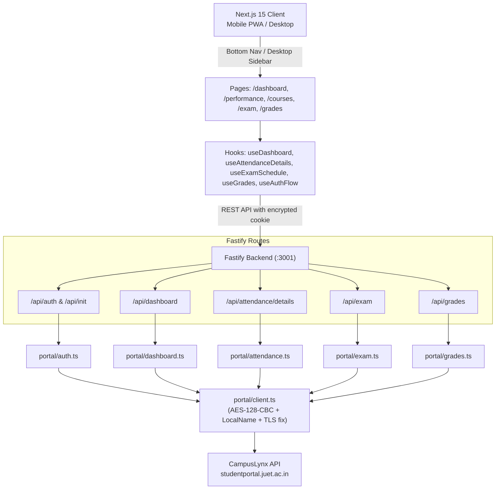

# Architecture & Modernization Design Specification

**Date**: 2026-10-06  
**Topic**: Full Codebase Cleanup, Pure CampusLynx Unification, Light/Dark-Only Mode & Mobile-First UX

---

## 1. Context & Motivation

JUET//SYNC originally began as a WebKiosk HTML-scraping proxy using Cheerio and JSDOM. With the transition to JUET's modern student portal (`studentportal.juet.ac.in`, powered by CampusLynx), all data surfaces (attendance, day-by-day logs, courses, marks, GPA, exam schedules, and grade cards) are now served through the portal's JSON API.

The legacy WebKiosk scrapers, Cheerio parsers, multi-palette theme engine, and desktop-centric UI add unnecessary complexity and bundle weight. This design unifies the stack onto a pure CampusLynx engine, simplifies the theme system to pure Light/Dark, and delivers a mobile-first experience with a native-style bottom navigation bar.

---

## 2. Goals & Non-Goals

### Goals
1. **Purge Legacy Scrapers & Dead Code**: Remove all WebKiosk HTML parsers, Cheerio/JSDOM dependencies, unused single-step login components, and obsolete test fixtures.
2. **Pure CampusLynx Backend**: Streamline auth, sessions, attendance, and dashboard routes to directly and exclusively use CampusLynx providers.
3. **Pure Light / Dark Mode**: Simplify `ThemeContext` and replace the multi-theme dropdown with a modern Sun/Moon icon toggle.
4. **Mobile-First UX Overhaul**:
   - Fixed glassmorphism Bottom Navigation Bar on mobile for one-thumb switching across all 5 sections.
   - Slide-over drawer reserved for student profile and logout.
   - All tables (attendance logs, grades, courses) adapt smoothly to touch-friendly card layouts on screens `< 640px`.

### Non-Goals
- Modifying WebKiosk endpoints (since WebKiosk is completely decommissioned in favor of CampusLynx).
- Adding new academic services not supported by the portal API.

---

## 3. Architecture & Data Flow

---

## 4. Component Details

### Backend
- **Removed**:
  - `backend/src/parsers/` (`auth.ts`, `dashboard.ts`, `attendanceDetails.ts`)
  - `backend/src/utils/webkiosk.ts`
  - `backend/scripts/inspect-webkiosk.ts`, `test-parser.ts`, `test-attendance.ts`, `test-parser-integration.ts`
  - `backend/tests/parsers.test.ts`, `webkiosk.test.ts`, `auth.test.ts`
  - `cheerio`, `jsdom`, `@types/jsdom` from `package.json`
- **Streamlined**:
  - `backend/src/routes/auth.ts`: Keep only CampusLynx two-step flow (`/api/init`, `/api/auth/verify-user`, `/api/auth`, `/api/logout`).
  - `backend/src/routes/session.ts`: Extract session directly from `PortalSessionIdentity`.
  - `backend/src/routes/dashboard.ts`: Direct call to `portal/dashboard.ts`.
  - `backend/src/routes/attendance.ts`: Direct call to `portal/attendance.ts`.

### Frontend
- **Removed**:
  - `frontend/components/FigmaLoginForm.tsx`
  - `frontend/components/ThemeSelector.tsx` (replaced by `ThemeToggle.tsx`)
- **Theme System**:
  - `frontend/context/ThemeContext.tsx`: Simplified to `theme: 'light' | 'dark'`, `toggleTheme: () => void`. Adds/removes `dark` class on `document.documentElement` and stores in `localStorage`.
  - `frontend/components/ThemeToggle.tsx`: Sleek, accessible button with animated Sun/Moon Lucide icons.
- **Mobile Navigation**:
  - `frontend/components/MobileBottomNav.tsx`: Fixed bottom bar (`fixed bottom-0 left-0 right-0 z-40 bg-white/80 dark:bg-slate-900/80 backdrop-blur-lg border-t border-gray-200 dark:border-slate-800 lg:hidden`).
  - 5 primary tabs with active indicator glow:
    1. Bunk Meter (`/dashboard`)
    2. Performance (`/dashboard/performance`)
    3. Courses (`/dashboard/courses`)
    4. Exams (`/dashboard/exam`)
    5. Grades (`/dashboard/grades`)
  - `frontend/components/DashboardLayout.tsx`: Integrates `MobileBottomNav`, adapts content padding (`pb-24 lg:pb-6`), and handles mobile drawer for profile & logout.

---

## 5. Testing & Validation Strategy
1. **Hermetic Route Tests**:
   - `npm test --workspace backend` (all remaining suites pass hermetically).
2. **TypeScript & Lint**:
   - `npm run type-check` (zero errors).
   - `npm run lint` (zero errors).
3. **Production Build**:
   - `npm run build` (Next.js App Router static/dynamic generation succeeds).
